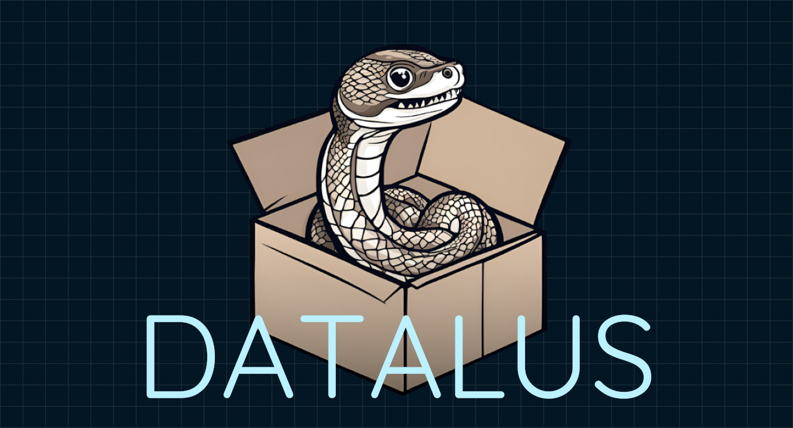

<p>
    <a href="https://www.linkedin.com/in/alexandergbraun" rel="nofollow noreferrer">
        
    </a>
    <a href="https://github.com/theNewFlesh" rel="nofollow noreferrer">
        
    </a>
    <a href="https://pypi.org/user/the-new-flesh" rel="nofollow noreferrer">
        
    </a>
    <a href="http://vimeo.com/user3965452" rel="nofollow noreferrer">
        
    </a>
    <a href="https://alexgbraun.com" rel="nofollow noreferrer">
        
    </a>
</p>

<p></p>

# Introduction
Datalus is a cookiecutter template for end-to-end automated, modular python repos.
From bare-bones local machine to Docker to CI to pip packages and Helm Charts.

A datalus repo is one in which the entire developer environment, including VSCode
and CI runs inside a development container. Through CI, that container is used
to publish a pip package which is then installed in the production container
built by this repo. That production container is then referenced by a Helm Chart
built by this repo. All of this is managed by a standardized python CLI that has
comes with each repo and has no dependencies.

# Usage
1. Install [cookiecutter](https://github.com/cookiecutter/cookiecutter) CLI
2. `cookiecutter https://github.com/theNewFlesh/cookiecutter-datalus`

Alternatively, you can use cruft (which uses cookiecutter). This method is recommended because cruft provides additional tooling for future template
updates.

1. `pip3 install cruft`
2. `cruft create https://github.com/theNewFlesh/cookiecutter-datalus`

# Purpose
Datalus is designed to facilitate the development of modern python applications.
It supports:
- Dash app development (ie Plotly + Flask + ReactJS)
- Flask app development
- Kuberenetes app development via Helm and ArgoCD
- Python library development (multi version pip packages via pyproject and PDM)

# Features
Datalus repositories are extremely opionated, comprehensive and automated repos
for modern python development inside docker.

Datalus supports the following via a command line interface and VSCode tasks:
- multiple version support via PDM
  - separate python environments per version per mode (dev and prod)
- automated invocation of most PDM commands (sync, lock, add, etc)
- automated, parallel testing across all environments (pytest)
- automated linting across all environments (ruff)
- automated formatting (ruff)
- automated type checking across all environments (mypy)
- automated documentation generation (sphinx)
- automated dependency graph generation (rolling-pin)
- automated code coverage reports and metrics (rolling-pin)
- automated publishing to PyPI
  - including CLI for package (ie command.py)
- automated jupyter lab serving, pre-customized with color theme and plugins
- openexr installation

# Developer Level Agreement
Functional division of labor between developer and devops requires a standard
contract across repositories. There are three essential parts to this contract:

  1. A consistent repository structure regarding directories, file names and
     configurations
  2. A consistent command line interface for running common developer tasks
  3. A consistent means of deploying applications to Kubernetes

# Design
Datalus solves this contract through comprehensive, standardized developer tools
and repository structure. The developer tools are accessed through the command
line and as VSCode tasks. Development is done against a dev docker container
defined in dev.dockerfile. Prod.dockerfile defines a slim production container
for running the repository code as an installed pip package.

# Gotchas

* The `default` dependency group is what your published package will require.
  No other groups are included.
* The `test` dependency group is for testing in dev and prod.
* The `lab` dependency group is for jupyter lab related libraries.
* The `dev` dependency group is for everything else.
* `[library] install-dev` and `[library] install-prod` updates `pyproject.toml`
  and the `dev.lock` and `prod.lock` files repectively.
* Always update `pyproject.toml` and lock files (`dev.lock` and `prod.lock`)
  togheter (ie single commit).

# Development CLI
Datalus repos come with a development command line interface (defined in cli.py)
that works with any version of python 2.7 and above, as it has no dependencies.
Additionally, a subset of these commands are defined in the VSCode workspace
file. Appending `--dryrun` to any command will output the exact shell code that
would have been run without the flag.

Its usage pattern is: `bin/repo COMMAND [-a --args]=ARGS [-h --help] [--dryrun]`

### Commands

| Command                    | Description                                                         | VSCode Task                   |
| -------------------------- | ------------------------------------------------------------------- | ----------------------------- |
| build-edit-prod-dockerfile | Edit prod.dockefile to use local package                            | [build] edit prod.dockerfile  |
| build-local-package        | Generate local pip package in docker/dist                           | [build] local-package         |
| build-package              | Generate pip package of repo                                        | [build] package               |
| build-prod                 | Build production version of repo for publishing                     | [build] prod                  |
| build-publish              | Run production tests first then publish pip package of repo to PyPi | [build] publish               |
| build-test                 | Build test version of repo for prod testing                         | [build] test                  |
| docker-build               | Build development image                                             |                               |
| docker-build-from-cache    | Build development image from registry cache                         |                               |
| docker-build-no-cache      | Build development image without cache                               |                               |
| docker-build-prod          | Build production image                                              |                               |
| docker-build-prod-no-cache | Build production image without cache                                |                               |
| docker-container           | Display the Docker container id                                     |                               |
| docker-destroy             | Shutdown container and destroy its image                            |                               |
| docker-destroy-prod        | Shutdown production container and destroy its image                 |                               |
| docker-image               | Display the Docker image id                                         |                               |
| docker-prod                | Start production container                                          |                               |
| docker-pull-dev            | Pull development image from Docker registry                         |                               |
| docker-pull-prod           | Pull production image from Docker registry                          |                               |
| docker-push-dev            | Push development image to Docker registry                           |                               |
| docker-push-dev-latest     | Push development image to Docker registry with dev-latest tag       |                               |
| docker-push-prod           | Push production image to Docker registry                            |                               |
| docker-push-prod-latest    | Push production image to Docker registry with prod-latest tag       |                               |
| docker-remove              | Remove Docker container                                             |                               |
| docker-restart             | Restart container                                                   |                               |
| docker-start               | Start container                                                     |                               |
| docker-stop                | Stop container                                                      |                               |
| docs                       | Generate sphinx documentation                                       | [docs] docs                   |
| docs-architecture          | Generate architecture.svg diagram from all import statements        | [docs] architecture           |
| docs-full                  | Generate documentation, coverage report, diagram and code metrics   | [docs] full                   |
| docs-metrics               | Generate code metrics report, plots and tables                      | [docs] metrics                |
| library-add                | Add a given package to a given dependency group                     | [library] add                 |
| library-graph-dev          | Graph dependencies in dev environment                               | [library] graph-dev           |
| library-graph-prod         | Graph dependencies in prod environment                              | [library] graph-prod          |
| library-install-dev        | Install all dependencies into dev environment                       | [library] install-dev         |
| library-install-prod       | Install all dependencies into prod environment                      | [library] install-prod        |
| library-list-dev           | List packages in dev environment                                    | [library] list-dev            |
| library-list-prod          | List packages in prod environment                                   | [library] list-prod           |
| library-lock-dev           | Resolve dev.lock file                                               | [library] lock-dev            |
| library-lock-prod          | Resolve prod.lock file                                              | [library] lock-prod           |
| library-remove             | Remove a given package from a given dependency group                | [library] remove              |
| library-search             | Search for pip packages                                             | [library] search              |
| library-sync-dev           | Sync dev environment with packages listed in dev.lock               | [library] sync-dev            |
| library-sync-prod          | Sync prod environment with packages listed in prod.lock             | [library] sync-prod           |
| library-update             | Update dev dependencies                                             | [library] update              |
| library-update-pdm         | Update PDM                                                          | [library] update-pdm          |
| quickstart                 | Display quickstart guide                                            | quickstart                    |
| session-lab                | Run jupyter lab server                                              | [session] lab                 |
| session-python             | Run python session with dev dependencies                            | [session] python              |
| session-server             | Runn application server inside Docker container                     | [session] server              |
| state                      | State of repository and Docker container                            |                               |
| test-coverage              | Generate test coverage report                                       | [test] coverage               |
| test-dev                   | Run all tests                                                       | [test] dev                    |
| test-fast                  | Test all code excepts tests marked with SKIP_SLOWS_TESTS decorator  | [test] fast                   |
| test-format                | Format all python files                                             | [test] format                 |
| test-lint                  | Run linting and type checking                                       | [test] lint                   |
| test-prod                  | Run tests across all support python versions                        | [test] prod                   |
| version                    | Full resolution of repo: dependencies, linting, tests, docs, etc    | [version] version             |
| version-bump-major         | Bump pyproject major version                                        | [version] bump-major          |
| version-bump-minor         | Bump pyproject minor version                                        | [version] bump-minor          |
| version-bump-patch         | Bump pyproject patch version                                        | [version] bump-patch          |
| version-commit             | Tag with version and commit changes to master                       | [version] commit              |
| zsh                        | Run ZSH session inside Docker container                             |                               |
| zsh-complete               | Generate oh-my-zsh completions                                      |                               |
| zsh-root                   | Run ZSH session as root inside Docker container                     |                               |
|                            | Reinstall all VSCode extensions                                     | [vscode] reinstall-extensions |

### Flags

| Short | Long      | Description                                          |
| ----- | --------- | ---------------------------------------------------- |
| -a    | --args    | Additional arguments, this can generally be ignored  |
| -h    | --help    | Prints command help message to stdout                |
| -     | --dryrun  | Prints command that would otherwise be run to stdout |


# Production CLI

Datalus repos come with a production command line interface defined in
command.py. pyproject.toml references this module for pip package installs.

Its usage pattern is: `repo COMMAND [FLAGS] [-h --help]`

### Commands
| Command         | Description                                                          | Flags | Flag Description |
| --------------- | ---------------------------------------------------------------------| ------| ---------------- |
| bash-completion | Prints BASH completion code to be written to a _repo completion file | -     | -                |
| zsh-completion  | Prints ZSH completion code to be written to a _repo completion file  | -     | -                |

---

# Repository Structure
The following is a comprehensive diagram of the Datalus repository structure:


```yaml
APP
   ├── README.md                               # README with install instructions
   ├── .gitignore                              # git config
   ├── .gitattributes                          # git config
   ├── APP.code-workspace                      # VSCode config (contains task commands)
   ├── .devcontainer.json                      # VSCode remote container config
   ├── .env                                    # needed by VSCode docker-compose
   ├── .gitlab-ci.yml                          # GitLab CI script
   ├── bin
   │   └── APP                                 # shell wrapper for CLI
```
```yaml
   ├── docker                                  # everything needed to build and run container
   │   ├── dev.dockerfile                      # development version of app image
   │   ├── prod.dockerfile                     # production version of app image
   │   ├── docker-compose.yml                  # dev means of starting container
   │   ├── .dockerignore                       # tells docker which files to ignore
   │   ├── scripts
   │   │  ├── prod-cli                         # prod cli script used by dev container (optional)
   │   │  ├── s_tools.sh                       # s6 daemon supervisor tools
   │   │  └── x_tools.sh                       # developer tools
   │   └── config
   │      ├── build.yaml                       # defines pip package builds
   │      ├── dev-env                          # dev environment variables
   │      ├── dev.lock                         # frozen dev dependencies
   │      ├── henanigans.zsh-theme             # zsh theme
   │      ├── pdm.toml                         # needed by PDM
   │      ├── prod.lock                        # frozen prod dependencies
   │      ├── prod.toml                        # used by prod.dockerfile
   │      ├── pyproject.toml                   # defines all dependencies
   │      ├── secret-env                       # credentials used for CI and developers
   │      ├── zshrc                            # zsh environment setup
   │      └── jupyter
   │         ├── jupyter_lab_config.py         # jupyter lab config
   │         └── lab
   │            └── ...                        # jupyter lab plugins
```
```yaml
   ├── python
   │   ├── cli.py                              # dev command line interface
   │   ├── conftest.py                         # pytest config (optional)
   │   └── APP                                 # app source code
   │      ├── __init__.py
   │      ├── command.py                       # prod CLI module (optional)
   │      ├── core
   │      │   ├── __init__.py
   │      │   └── ...                          # core logic modules
   │      └── server                           # (optional)
   │         ├── __init__.py
   │         └── ...                           # server logic modules
```
```yaml
   ├── sphinx                                  # automatic documentation config
   │   ├── conf.py                             # sphinx config
   │   ├── make.bat                            # sphinx config
   │   ├── Makefile                            # sphinx config
   │   ├── cli.rst                             # cli docs
   │   ├── core.rst                            # core logic docs
   │   ├── index.rst                           # sphinx toc tree
   │   ├── modules.rst                         # sphinx toc tree
   │   ├── server.rst                          # server.py docs (optional)
   │   ├── intro.rst                           # README.md as rst
   │   └── style.css                           # used by sphinx for styling docs
```
```yaml
   ├── mkdocs                                  # markdown documentation config (optional)
   │   ├── mkdocs.yml                          # mkdocs file index
   │   └── md
   │       ├── index.md                        # markdown docs homepage
   │       ├── style.css                       # custom stylesheet
   │       └── ...                             # markdown files
```
```yaml
   ├── docs                                    # documentation build (/public if using gitlab)
   │   ├── index.html                          # docs homepage
   │   ├── architecture.svg                    # auto-generated graph of app dependecies
   │   ├── plots.html                          # code metric plots
   │   ├── all_metrics.html                    # master code metrics table
   │   ├── cyclomatic_complexity_metrics.html  # code metrics table
   │   ├── halstead_metrics.html               # code metrics table
   │   ├── htmlcov
   │   │   └── index.html                      # code coverage report
   │   └── resources
   │       └── ...                             # additional media for docs
```
```yaml
   ├── helm                                    # Helm app definition (optional)
   │   ├── README.md                           # app README
   │   ├── Chart.yaml                          # Helm chart
   │   ├── values.yaml                         # default values
   │   ├── .helmignore                         # ignores files
   │   └── templates
   │       ├── _helpers.tpl                    # creates vars from values.yml
   │       ├── argocd-application.yaml         # ArgoCD app definition
   │       ├── deployment.yaml                 # k8s deployment
   │       ├── desktop-volume.yaml             # allows mounting of repo into pod
   │       ├── env-configmap.yaml              # env vars
   │       ├── env-secret.yaml                 # env secrets
   │       ├── image-pull-secret.yaml          # image pull secret (ie ECR creds, etc)
   │       ├── namespace.yaml                  # app namespace
   │       ├── nginx-ingress.yaml              # Nginx ingress (HarvesterOS)
   │       ├── repo-volume.yaml                # mount repo in volume
   │       ├── service.yaml                    # app service
   │       └── traefik-ingress.yaml            # Traefik ingress (RancherOS)
```
```yaml
   ├── notebooks
   │   └── ...                                 # jupyter lab notebooks
   ├── resources
   │   └── ...                                 # resources used by app
   ├── artifacts                               # (optional)
   │   └── ...                                 # dash artifacts
   └── templates                               # (optional)
       └── ...                                 # dash templates
```

---

# Datalus CLI
Datalus comes with CLI tools for managing repos created with cruft.

Its usage pattern is: `bin/cli.py COMMAND --flag-1 arg --flag-2 arg [-h --help]`

### Commands

| Command                     | Description                                                | Flag 1                                   | Flag 2                               |
| --------------------------- | ---------------------------------------------------------- | ---------------------------------------- | ------------------------------------ |
| `extract-cookiecutter-yaml` | Extract cookiecutter yaml file from given .cruft.json file | `--source` cruft.json file               | `--target` cookiecutter yaml file    |
| `build-test-repo`           | Build datalus test repo                                    | `--target` parent directory of test repo |                                      |
| `patch-cruft-json`          | Patch .cruft.json file with skip patterns                  | `--target` cruft.json file               |                                      |
| `cruft-update-repo`         | Apply silent cruft update to target repo                   | `--target` cruft.json file               | `--branch` datalus branch or commmit |
| `cruft-check-files`         | Check for extra and missing template files                 | `--source` repository                    | `--branch` datalus branch or commmit |
